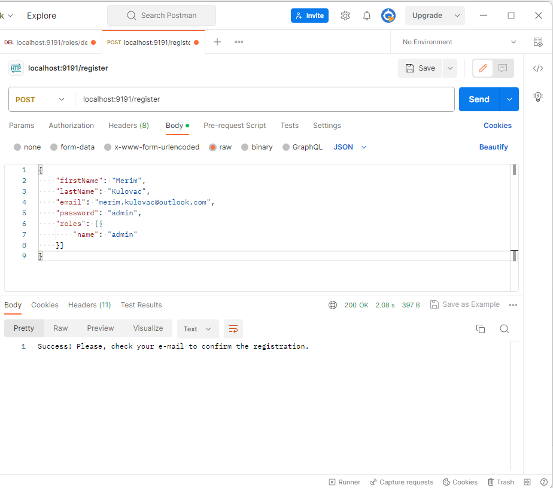
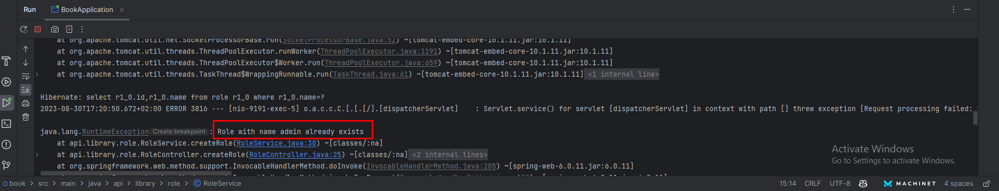
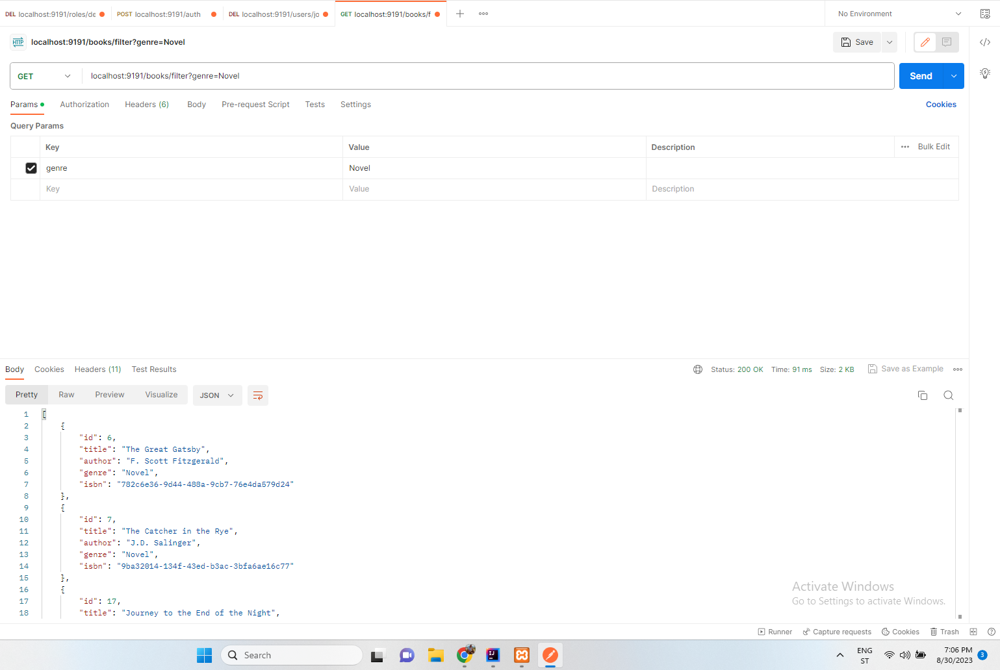
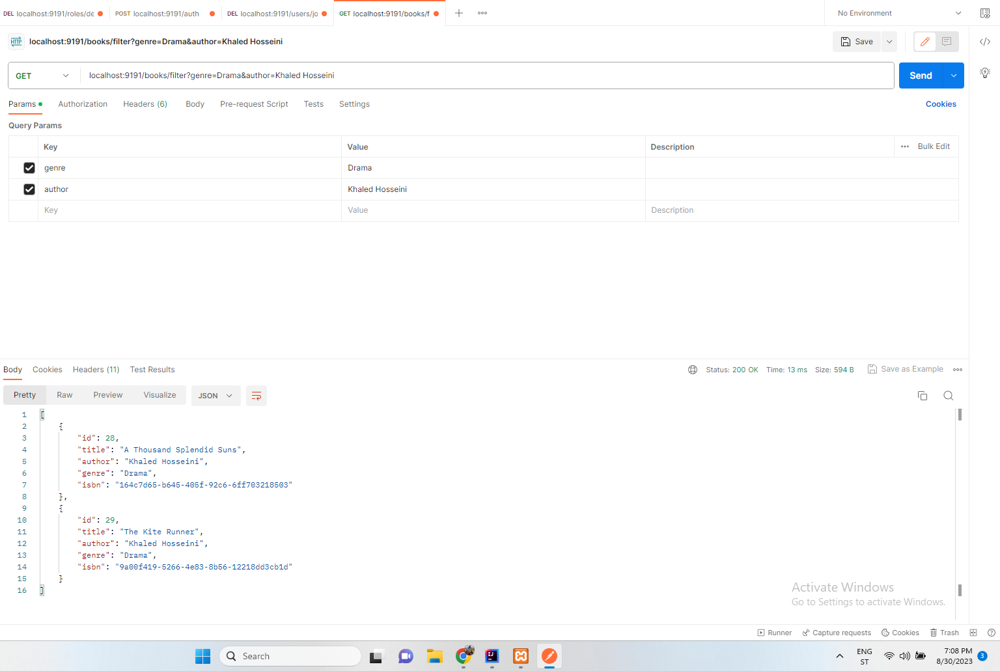
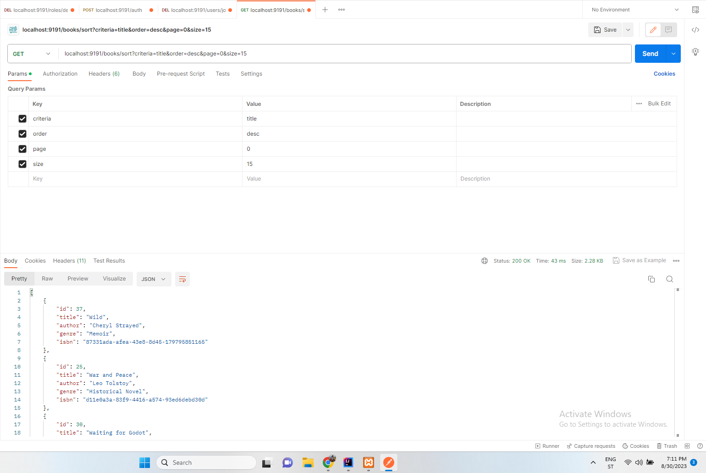

<!-- PROJECT LOGO -->
 

  

  <h3 align="center">Book store API</h3>

  

    Api for book store
     
    <a href="https://github.com/mkulovac1/bookStoreApi"><strong>Explore the docs »</strong></a>
     
     
    <a href="">View Demo</a>
    ·
    <a href="https://github.com/mkulovac1/bookStoreApi/issues">Report Bug</a>
  

<!-- ABOUT THE PROJECT -->
## About The Project

  Book store API is a project that can be used, as the name suggests, in a book store to manipulate books and users on backend. The api is made in Java (framework - latest Spring Boot version) and MySQL. 
  JWT authentication is used. As for the user, it is possible to perform standard CRUD operations as admin. 
  It is possible to confirm the registration via a link, this is necessary so that the user can login into the system later. The user has 10 minutes to confirm the registration, if user does not confirm it, user receives a new link for confirmation to the email. 
  As for books, it is also possible to do CRUD operations as an admin. 
  In addition, we have sorting and filtering of books by several criteria (simultaneously and individually). 
  Pagination has also been added
  The role is very important, so a special class, service and controller was created for it.
  There are two roles in the system, user and admin. 
  Admin can do all operations. 
  User can do everything except CRUD operations for users, books and roles.

(<a href="#readme-top">back to top</a>)

## Built With

* Java
* Spring Boot
* MySQL

(<a href="#readme-top">back to top</a>)

<!-- USAGE EXAMPLES -->
## Usage

Here you can see examples of using this API through Postman.

### REGISTRATION

 

**Empty USER table:**

    

**Register:**

    

**Verification via e-mail:**

    

**Confirming registration:**

    

**Late confirmation:**

    

        

### LOGIN/AUTH:

 

**Login:**

    

**Decoding JWT:**

    

        

### ROLES

    

**Creating role:**

    

**Creating existing role:**

    

**Getting all roles:**

    

**Roles in database:**

    

**Deleting role:**

    

**Database after deleting role:**

    

        

### USERS

 

**Adding user:**

    

**Database after adding user:**

    

**All users:**

    

**All users in database:**

    

**Deleting user:**

    

**Database after deleting user:**

    

**Activate user:**

    

**Activate user - database:**

    

**Deactivate user:**

    

**Deactivate user - database:**

    

**Get user by e-mail:**

    

**Change/update user's password:**

    

         

### BOOKS

 

**Empty BOOK table:**

    

**Adding multiple books:**

    

**Database after adding multiple books:**

    

**Adding one book:**

    

**Database after adding one book:**

    

**Getting all books:**

    

**Getting one book:**

    

**Database before updating the book:**

    

**Updating the book:**

    

**Database after updating the book:**

    

**Deleting the book:**

    

**Filtering books using one criteria**

    

**Filtering books using multiple criteria**

    

**Sorting books with pagination:**

    

 

_For more examples, please refer to the [Documentation](https://github.com/mkulovac1/bookStoreApi/documentation)_

(<a href="#readme-top">back to top</a>)

<!-- CONTRIBUTING -->
## Contributing

Contributions are what make the open source community such an amazing place to learn, inspire, and create. Any contributions you make are **greatly appreciated**.

If you have a suggestion that would make this better, please fork the repo and create a pull request. You can also simply open an issue with the tag "enhancement".
Don't forget to give the project a star! Thanks again!

1. Fork the Project
2. Create your Feature Branch (`git checkout -b feature/AmazingFeature`)
3. Commit your Changes (`git commit -m 'Add some AmazingFeature'`)
4. Push to the Branch (`git push origin feature/AmazingFeature`)
5. Open a Pull Request

(<a href="#readme-top">back to top</a>)

<!-- CONTACT -->
## Contact

Merim Kulovac, [@merimkulovac](https://www.linkedin.com/in/merimkulovac/), e-mail: merim.kulovac@outlook.com

(<a href="#readme-top">back to top</a>)

